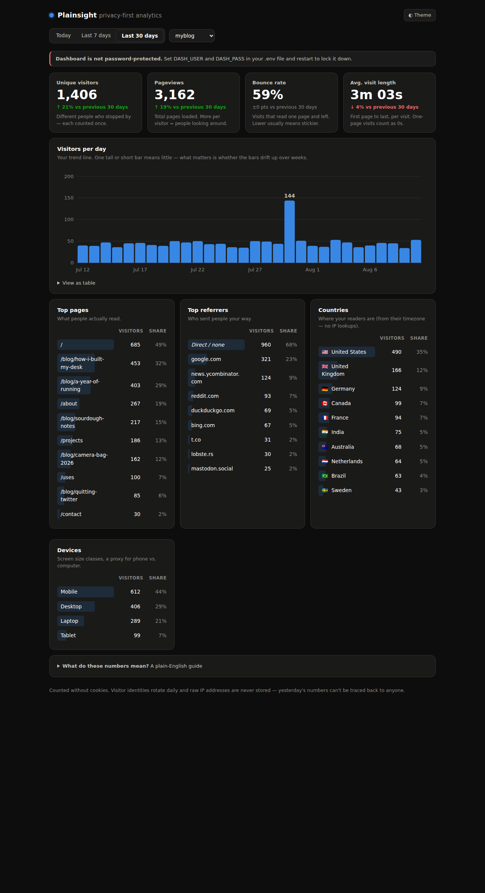

# Plainsight

Privacy-first web analytics for personal sites, in one process and one file of
Python. No cookies, no consent banner needed for this data, no accounts, no
build step, **zero dependencies** — just Python 3.9+ and SQLite.



## The honest note, up front

**At serious traffic, self-host the real [Plausible](https://plausible.io/docs/self-hosting) instead.**
This tool is for personal sites — a blog, a side project, a portfolio. It keeps
every event as one SQLite row and computes everything at query time, which is
delightfully simple and plenty fast up to hundreds of thousands of events, but
it has no clickhouse, no clustering, no team features, and no ambitions.
If your site takes off, migrate — Plausible is excellent.

## Quick start

```bash
git clone <this repo> && cd analytic-tool
cp .env.example .env         # set DASH_USER / DASH_PASS
python3 app.py               # http://localhost:8000/dashboard
```

Want to see the dashboard with realistic fake data first?

```bash
python3 seed_demo.py && python3 app.py
```

## Add the snippet to your site

One line, just before `</head>`. Under 2 KB, vanilla JS, no cookies:

```html
<script defer src="https://stats.example.com/a.js" data-site="myblog"></script>
```

- `data-site` — a short id you pick. **Use a different id per site** and switch
  between them in the dashboard's site dropdown (that's all multi-site is).
- `data-api` — optional; set it if the beacon endpoint lives on a different
  origin than the script.
- `data-dev` — optional; set to anything to also count visits from `localhost`.

The snippet counts normal page loads *and* single-page-app navigations
(`pushState`/`popstate`), and skips duplicate hits on the same path.

## What you get

- **Unique visitors, pageviews, bounce rate, average visit length** — each with
  a trend arrow vs. the previous equal period (today vs. yesterday, this week
  vs. last week…).
- **Visitors per day** bar chart (per hour for "Today") as inline SVG — hover or
  keyboard-focus any bar for exact numbers, or expand "View as table."
- **Top pages, top referrers, countries, devices** for Today / 7 days / 30 days.
- **Dark and light mode**, with a toggle; fast server-rendered HTML, no
  JavaScript frameworks.
- **A plain-English guide** built into the dashboard ("What do these numbers
  mean?") so you never have to explain bounce rate to anyone — including
  yourself.

### What the numbers mean (the everyday-person version)

| Number | What it is | Why you'd care |
|---|---|---|
| Unique visitors | How many different people came by; each counts once per day | Your reach. The one number to watch over time. |
| Pageviews | Every page load | Much higher than visitors? People are sticking around and reading more. |
| Bounce rate | Share of visits that read one page and left | High isn't automatically bad — a blog reader who got what they came for still "bounced." Watch the trend, not the number. |
| Avg. visit length | First page to last, per visit | A floor, not a truth: one-page visits count as 0 since there's no second timestamp. |
| Trend arrows | This period vs. the equal one before it | One red day means nothing. A red month is worth a look. |

## How the privacy works

- **No cookies, no localStorage, no fingerprinting.** The snippet sends only:
  site id, path, referrer, viewport width, and timezone.
- **Visitors are counted server-side** with
  `sha256(daily_salt + site + IP + user-agent)`. The salt is random, rotates
  every midnight, and old salts are deleted — so a visitor gets a new anonymous
  id every day and yesterday's data can never be linked back to a person.
  **Raw IP addresses are never written to disk.**
- **Countries come from the browser's timezone**, not from IP geolocation — no
  GeoIP database to download, nothing personal stored. If you're behind
  Cloudflare, its `CF-IPCountry` header is used instead (more accurate).
- **Referrers are reduced to a hostname** (`news.ycombinator.com`), never full
  URLs, and same-site referrers are dropped in the browser before sending.
- Query strings and fragments are stripped from paths before storage.

## Mechanics

- **Bot filtering:** obvious bots are dropped at ingest by user-agent
  (crawlers, preview fetchers, uptime monitors, headless browsers, HTTP
  libraries); empty user-agents too. This won't stop a determined scraper —
  nothing UA-based does — but it keeps the numbers honest.
- **Sessionization:** a visit ends after **30 idle minutes**. Bounce rate =
  visits with exactly one pageview. Computed at query time with SQL window
  functions.
- **Storage:** one row per event in `analytics.db`, indexed on `(site, date)`.
  Days use the server's local timezone.
- **Ingest:** `POST /api/event` returns `202` no matter what — a beacon is
  never worth an error page.

## Configuration (`.env`)

| Key | Default | |
|---|---|---|
| `DASH_USER` / `DASH_PASS` | *(unset)* | Basic-auth for `/dashboard`. **Unset = no auth**, and the dashboard shows a warning until you set them. |
| `PORT` | `8000` | |
| `HOST` | `0.0.0.0` | |
| `DB_PATH` | `analytics.db` | |

## Deploying

Run it behind any reverse proxy that terminates TLS (Caddy, nginx) and keep it
alive with systemd:

```ini
# /etc/systemd/system/plainsight.service
[Unit]
Description=Plainsight analytics
After=network.target

[Service]
WorkingDirectory=/opt/plainsight
ExecStart=/usr/bin/python3 app.py
Restart=always

[Install]
WantedBy=multi-user.target
```

If a proxy sits in front, it should pass `X-Forwarded-For` (for the visitor
hash) — both Caddy and nginx do by default. Back up by copying `analytics.db`.
